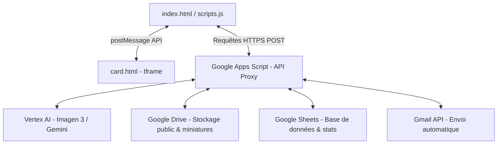

# 📸 Photo Booth Agentique — Google Cloud Summit 2026

Une expérience de Photo Booth interactive, immersive et propulsée par l'Intelligence Artificielle de Google Cloud, conçue sur mesure pour le stand **ACEO Tech** lors du **Google Cloud Summit 2026**.

L'application permet aux visiteurs de capturer leur portrait via leur webcam, de choisir un archétype technologique (parmi 4 profils de "héros" Cloud), et de se voir transformés en avatars 3D stylisés et héroïques grâce aux modèles de génération d'images de pointe de **Google Cloud Vertex AI** (notamment **Imagen 3** orchestré via l'API Vertex).

---

## 🌟 Fonctionnalités Clés & Expérience Utilisateur

*   **Capture Vidéo & Webcam (`index.html`) :** Intégration fluide de la webcam avec effet miroir, compte à rebours interactif de 3 secondes avec retours visuels et sonores rétro-futuristes.
*   **Prompt Engineering Héroïque :** Algorithme de génération de prompt dynamique qui préserve l'identité du visiteur (physionomie, traits, ethnicité, coiffure) tout en appliquant la charte graphique et thématique héroïque de l'archétype choisi.
*   **Trading Card 3D Interactive (`card.html`) :** 
    *   **Effet Tilt Holographique :** Rendu fluide réagissant aux mouvements de la souris (perspectives 3D et interpolation linéaire LERP pour un effet premium).
    *   **Analyse de Contraste / Luminosité :** Analyse automatique par canvas des zones les plus claires de l'image générée.
    *   **Émanation de Particules :** Génération dynamique de flux de particules et d'overlays lumineux pulsant uniquement depuis les points saillants de la carte de trading.
*   **Audio Synthétique en Temps Réel :** Utilisation avancée de l'**API Web Audio** pour générer des effets sonores dynamiques et synthétisés à la volée (survol de boutons, clic de validation, obturateur de caméra et crescendo de révélation cinématographique), accompagnés d'une musique d'ambiance immersive.
*   **Diffusion & Partage Instantanés :**
    *   **QR Code Dynamique :** Scan rapide pour télécharger instantanément l'avatar généré sur son smartphone.
    *   **Envoi par Email :** Template HTML professionnel envoyé directement dans la boîte de réception de l'utilisateur avec l'avatar personnalisé incrusté du logo ACEO.
*   **Leaderboard du Salon :** Suivi interactif en temps réel du nombre de générations par archétype pour encourager la compétition amicale sur le stand.
*   **Galerie Collaborative :** Carrousel défilant dynamique affichant les avatars générés récemment par les autres visiteurs du stand pour animer l'écran géant.

---

## 🏗️ Architecture Technique Serverless

Le projet repose sur une séparation stricte des responsabilités (découplage Front/Back) pour garantir une sécurité totale des clés d'API et une charge d'infrastructure minimale.



### 1. Front-End (Client / Hébergé sur GitHub Pages)
Composé exclusivement de fichiers statiques optimisés :
*   `index.html` : Structure et design principal (responsive, animations HSL, grain de film texturé).
*   `scripts.js` : Moteur logique (gestion de flux média, Web Audio, prompts, synchronisation iframe, intégration QRCode.js, requêtes API).
*   `card.html` : Iframe autonome hébergeant le rendu 3D, le canvas de particules lumineuses et l'algorithme d'analyse d'image.

### 2. Back-End (Serveur / Google Apps Script)
Sert de passerelle sécurisée pour masquer les identifiants et orchestrer l'ensemble des services Google Cloud et Workspace :
*   **Vertex AI API :** Reçoit le prompt enrichi et l'image brute en base64 pour générer l'avatar haute résolution.
*   **Google Drive :** Enregistre les avatars dans un répertoire cloud public et fournit des URL de miniatures optimisées pour l'affichage en salon.
*   **Google Sheets :** Enregistre en temps réel les participants (prénom, email, choix d'archétype, ID de fichier) et sert d'API de statistiques pour le Leaderboard.
*   **Gmail Service :** Reçoit la requête d'envoi et distribue le courrier personnalisé à l'utilisateur avec l'avatar finalisé (logo ACEO incrusté).

---

## ⚙️ Configuration & Déploiement

### Prérequis
1.  Un dépôt GitHub configuré avec **GitHub Pages** actif pour le Front-End.
2.  Un projet **Google Apps Script** déployé en tant qu'Application Web (accessible en mode "Anyone" ou "Anonymous") configuré avec les accès à Vertex AI, Drive, Sheets et Gmail.
3.  Une variable d'environnement Windows `GITHUB_TOKEN` configurée sur votre poste de développement local pour lier et automatiser les déploiements Git.

### 🔌 Variables de Configuration dans `scripts.js`
À la racine de `scripts.js`, modifiez les constantes pour l'associer à vos propres instances :
```javascript
const API_URL  = 'https://script.google.com/macros/s/.../exec'; // URL de votre Web App Google Apps Script
const SECRET   = 'votre-secret-uuid';                           // Jeton d'authentification partagé avec l'Apps Script
const LOGO_URL = 'https://raw.githubusercontent.com/.../logo.png'; // Logo à incruster sur l'avatar final
const IDLE_TIMEOUT = 120;                                       // Temps d'inactivité avant retour à l'écran de veille (en secondes)
```

> [!IMPORTANT]
> **Sécurité des Tokens :** Ne commitez jamais votre jeton `SECRET` ou vos tokens d'API personnels directement sur un dépôt public. Utilisez les variables d'environnement système (comme `GITHUB_TOKEN`) ou des fichiers de configuration locaux exclus via `.gitignore`.

---

## 🧙 Les 4 Archétypes Cloud Hero

| Archétype | Icône | Description visuelle générée |
| :--- | :---: | :--- |
| **Security Sentinel** | 🛡️ | Bouclier lumineux avec runes cryptographiques, armure de verrous hexagonaux bleus et verts, clés dorées et portes de coffres-forts flottant en arrière-plan. |
| **AI Sorcerer** | 🧙 | Orbes lumineuses représentant des agents IA, mains diffusant des faisceaux de réseaux de neurones, robes Gemini géométriques, lignes de code magiques. |
| **Cloud Architect** | 🏗️ | Plateforme de nuages stylisés, plans architecturaux lumineux (Kubernetes, pods, maillages réseau), cape futuriste avec circuits imprimés. |
| **Data Wrangler** | 🗄️ | Cape en flux de données descendants bleus/verts, tablette projetant des schémas BigQuery/SQL, particules de données en lévitation. |

---

## 📜 Licences & Crédits
*   Conçu par **ACEO Tech** pour le **Google Cloud Summit 2026**.
*   Librairies utilisées : [QRCode.js](https://github.com/davidshimjs/qrcodejs) (génération locale de QR Code).
*   API exploitées : Google Cloud Vertex AI Client, Web Audio API, getUserMedia MediaDevices API.
